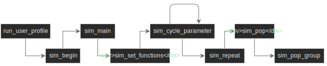

# VE Simulation Documentation

Date 12/02/2019

## Structure

### Script files overview

Each of the following functions resides in a .R script file named the same as the function

### Main Functions

#### `run_user_profile`

Can be ran from command line with arguments: `--save_directory` `mydir`  `--profile_name`  `myprof`

Arguments:

* `save_directory` - directory for data to be written in
* `user_profile` - a list that is a direct result of reading the files in the profile folder:
  * `user_data` - dataframe form of `estimates.csv`
  * `allowed_groups` - all groups (names of parameter sets) to be used
  * `sim_options` - a list:
    * `nsam` - starting population size
    * `Npop` - amount of populations to simulate
    * `vary_rule` - rule to be used for parameter variation
  * `vary_table` - table of values to be used for the parameters to be varied
* `scripts_dir` - path to scripts directory

Reads the profile (located in `user_settings`) and builds appropriate arguments for `sim_begin`. [Profile-based usage](#Profile-based-usage) section has more information on profiles.

#### `sim_begin`

Arguments:

* `sim_args` - a list of argumets:
  * `group` - name of parameter set(s) in `estimates.csv` to use
  * `save_directory` - directory for data to be saved
  * `variants` - parameter(s) to vary (meaning that their values in `estimates.csv` are to be ignored and `vary_table` to be used instead)
  * `vary_in_group` - optional argument. Parameters will only be varied in the groups specified. If left empty, parameters will be varied in all groups.
* `user_profile` - same as `run_user_profile`
* `scripts_dir` - path to scripts directory

Builds arguments for `sim_main` and writes data that `sim_main` returns into the save directory. Also saves `settings` that it passes to `sim_main` to `settings_used` folder inside the save directory, saves estimates that it read to `parameters_used` folder inside the save directory and saves the full log of the simulation run to `full_log` folder inside the save directory.

#### `sim_main`

Arguments:

* `estimates` - a dataframe containing parameter estimates. Expected to be read from `estimates.csv` in the profile folder
* `settings` - an R list containing:
  * `nsam` - starting population size
  * `Npop` - amount of populations to simulate
  * `group` - current group name
  * `to_vary` - list of parameters and values to cycle through. Expected to be a subset of `vary_table` in profile folder
  * `vary_in_group` - group in which the parameter will be varied according to `to_vary`. The other groups will be set to the values specified in `estimates`
  * `save_locs` - a list with save locations for data and log files

Builds arguments for `sim_set_functions`. Does not change data returned by `sim_set_functions` before returning it to `sim_begin`.

#### `sim_set_functions`

Arguments:

* `pop_est` - a list containing parameter values for every group. Those values come from `estimates.csv` with the following modifications expected to have been made beforehand:
  * Group names are lowercased and free of garbage (such as dots or parentheses that can be there as an artefact of `read.csv` not reading some names properly)
  * If there is only one group, `p_clin_ari` (no absolute estimates available) and `prop` (irrelevant when there is only one group) are set to 1.
* `settings` - same as `sim_main`

Main purpose is to modify `pop_est` by replacing every every parameter/group entry with a function specified by the appropriate entry in `settigs$to_vary`. \
For example, if `p_vac` is to be varied according to a beta distribution with parameters alpha = 3 and beta = 3 in group `special_no`, then the `pop_est` entry for `p_vac` (for group `special_no`) will be replaced by a callable object whose call (without arguments) will be equivalent to calling `rbeta(Npop, 3, 3)`. \
Used entries in `settings$to_vary` are removed before `settings` list is passed on.

#### `sim_cycle_parameter`

Arguments:

* `pop_est` - a list containing parameter values for every group.
* `settings` - same as `sim_set_functions` except with used entries removed.

Main purpose is to modify `pop_est` by setting the appropriate entries to values specified by `to_vary`. Once it sets all listed parameters to one of their values it formats `pop_est` for `sim_repeat` and passes it. Once `sim_repeat` returns, if there are parameter value combinations still left to pass it does so and appends the returned data to the existing one. Once it returns to `sim_main` the data is ready to be written.

#### `sim_repeat`

Arguments:

* `pop_est` - same as in `sim_cycle_parameter` with one change:
  * `nsam` entry is added. If there is one group, this is the same as `nsam` in `settings`. If there are multiple, `prop` entry is used to set `nsam` in groups so that the sum is equal to `nsam` in `settings`
* `Npop` - amount of times to repeat the simulation.
* `par_log` - log file for loop execution.

Main purpose is to call `sim_pop` many times and aggregate results that all those calls return. For fixed variation, the same value will be passed `Npop` times. For probabilistic variation, each population will get a different randomly generated value. That generation happens by calling functions set by `sim_set_functions`

#### `sim_pop`

Arguments:

* `pop_est` - same as in `sim_repeat`

Modifies `pop_est`:

* Converts it back to a dataframe - list structure is expected to support that at this point.

Simulates a full population. \
Passes each column in modified `pop_est` to `sim_pop_group` as a named vector. Counts the amount of cases and controls from the data returned by `sim_pop_group`. If there are multiple groups, sums them to get overall counts. Then uses that to obtain VE estimates for each group (and the population overall if there are multiple groups). \
Returns a dataframe with VE estimates and group names.

#### `sim_pop_group`

Arguments:

* `parameters` - and array that is subsettable by the following names:
  * `nsam` - amount of individuals to simulate
  * `p_vac` - proportion vaccinated
  * `sens_vac` - sensitivity of exposure (vaccination status) measurement
  * `spec_vac` - specificity of exposure (vaccination status) measurement
  * `IP_flu` - risk of flu
  * `IP_nonflu` - risk if non-flu ARI
  * `VE` - true flu vaccine effectiveness
  * `p_sympt_ari` - proportion of ARI that is symptomatic
  * `p_clin_ari` - proportion of symptomatic ARI that is clinically assessed
  * `p_test_ari` - proportion of clinically assessed ARI that is tested for flu
  * `p_test_nonari` - proportion of people without clinically assessed ARI who get tested for flu
  * `sens` - sensitivity of influenza test
  * `spec` - specificity of influenza test

Simulates a group based on the given parameters. Returns a dataframe with the following columns:

* `vac_true` - 1 for vaccinated, 0 for not
* `vac_mes` - 1 for recorded as vaccinated, 0 for not
* `flu` - 1 for infected with flu, 0 for not
* `nonflu` - 1 for infected with a non-flu ari, 0 for not
* `ari` - 1 if any ari, 0 if not (sum of `flu` and `nonflu`)
* `sympt` - 1 for symptomatic, 0 for not
* `clin` - 1 for clinically assessed, 0 for not
* `tested` - 1 for tested for influenza, 0 for not
* `testout` - 1 for positive, 0 for negative, NA if not tested

## Profile-based usage

A profile is a folder inside `user_settings` with files: `allowed_groups.json estimates.csv sim_options.json vary_table.json`

* Profile structure

  * `estimates.csv` holds the parameter values to be passed to the simulation function. Columns correspond to different parameter sets. Which columns (sets) will be passed is controlled by `allowed_groups.json`

  * `allowed_groups.json` defines a list of groups (parameter sets) that will be used for the simulation.

    Example 1: `["special_no"]` will result in only the parameter set in column `special_no` being passed. This will result in simulations of populations where every individual is created using parameter values specified in `special_no` column in `estimates.csv`

    Example 2: `["special_no", "special_sens"]` will result in the parameter set in column `special_no` being passed leading to the corresponding population simulations. Then the parameter set in column  `special_sens` will be passed leading to another set of simulations.

    * Defining multiple groups for one simulation set is possible as a nested list:

      Example: `["special_no", ["children", "adults", "elderly"]]` will result in one simulation set with the populations consisting of one group defined by the `special_no` column and another simulation set with the populations consisting of multiple groups defined by `children adults elderly` columns. Proportions of groups are controlled by `prop` parameter in `estimates.csv` (`prop` parameter is ignored when only one group is present in a population)

      When multiple groups are defined, the ones where parameters are to be varied should be marked with *. If no such symbols are present, parameters will be varied in all groups.

      Example:  `["special_no", ["children*", "adults", "elderly"]]` will result in variation only occurring in the `children` group.

  * `sim_options.json` defines `nsam` `Npop` `vary_rule`

    * `nsam` - starting population size

    * `Npop` - amount of populations to simulate for any one parameter set

    * `vary_rule` - controls variation. Is a list of elements, each one will be treated as a regular expression when looking for parameters to vary in `vary_table.json`

      Example: `[".", "p_test_nonari"]` means that all the parameters will be varied as per `vary_table.json` as well as `p_test_nonari`. Resulting data will have all combinations of possible `p_test_nonari` values with the possible values of every other parameter that appears in `vary_table.json`

  * `vary_table.json` contains all values of the parameters to be used in simulations. For probabilistic variation the entry should be: `["distribution_name", par1, par2]`, example: `["beta", 3, 3]`

* Defining a profile

  * Initialization: easiest way is to copy `default` folder inside `user_settings` and rename it
  * Definition: edit the appropriate files

* Running profile: have R execute `run_user_profile.R` script (located in the scripts folder) with the following arguments:

  `--save_directory` `path_to_some_directory` `--profile_name` `some_profile_name`

  * Example on Windows:

    `Rscript run_user_profile.R --save_directory my_directory --profile_name my_profile`

    ​Assuming `Rscript` is defined in `PATH` system environment variable. If not, either define it or specify full path to `Rscript.exe`, example:

    `C:\Program Files\R\R-3.5.2\bin\Rscript.exe run_user_profile.R --save_directory my_directory --profile_name my_profile`

## Graphing results

Have R execute `graph_conventional.R` script with the following arguments: \
`--save_directory` `mydir` `--data` `my_data_folder*` `--sample_size**` `--errors**` `--fix_y**` \
\* Data folder is expected to contain `full_log`, `parameters_used`, `settings_used` folders. Those are created automatically when a profile is run. \
\*\* Optional arguments:

* `--sample_size` - if present, size of points will scale with the underlying size of the study.
* `--errors` - if present, error bars will appear on the graphs
* `--fix_y` - if present, minimum and maximum values for the y axis in all graphs will be the minimum and maximum values of `VE_est_mean` found in all files in the data folder.

Graphs will be saved to directory specified by `save_directory`. Also, `full_log`, `parameters_used`, `settings_used` folders will be copied from data directory to save directory.